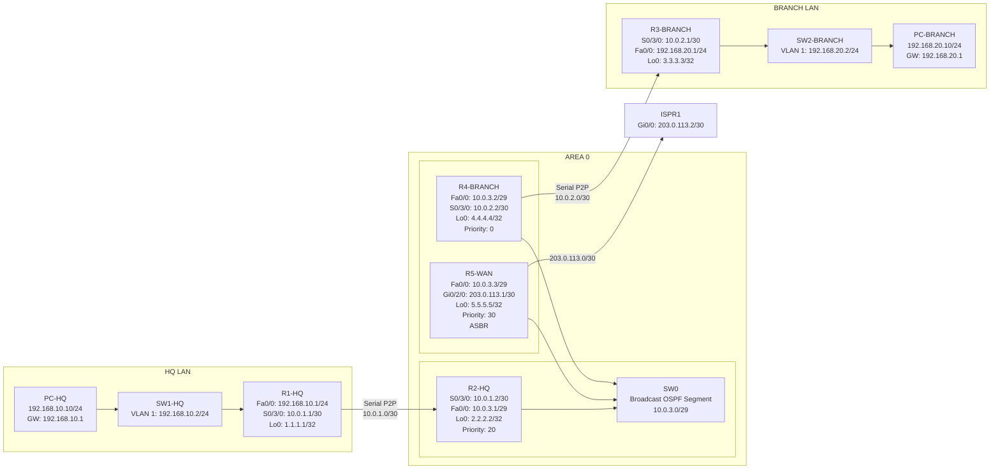

## Logical Topology

---

# Why this version is better

## It matches your physical topology more closely
- HQ is grouped separately
- Branch is grouped separately
- OSPF transit core is grouped in **Area 0**
- WAN edge and ISP remain separate

## It reads better on GitHub
The structure is easier to understand than one long chain.

## It keeps the same technical meaning
Nothing changes logically:
- serial P2P links are still clear
- Ethernet broadcast segment is still clear
- WAN edge / ISP is still clear

---

# Important note about Mermaid
Even with this improved version, **GitHub Mermaid will still not place items exactly like Packet Tracer**.

So think of it this way:

- **Physical topology image** = exact lab layout
- **Mermaid logical diagram** = clean logical grouping

That is the right use of each.

---

# My recommendation for your README
Keep this order:

1. **Physical Topology**
2. **Logical Topology**
3. **Device Roles**
4. **IP Addressing Plan**

That is already the correct documentation flow.

---

# If you want it even closer to your Packet Tracer layout
I can give you a second Mermaid version with:
- **HQ subgraph on top**
- **BRANCH subgraph below**
- **Area 0 in the center/right**
- more “boxed” structure to visually resemble your screenshot more closely.

