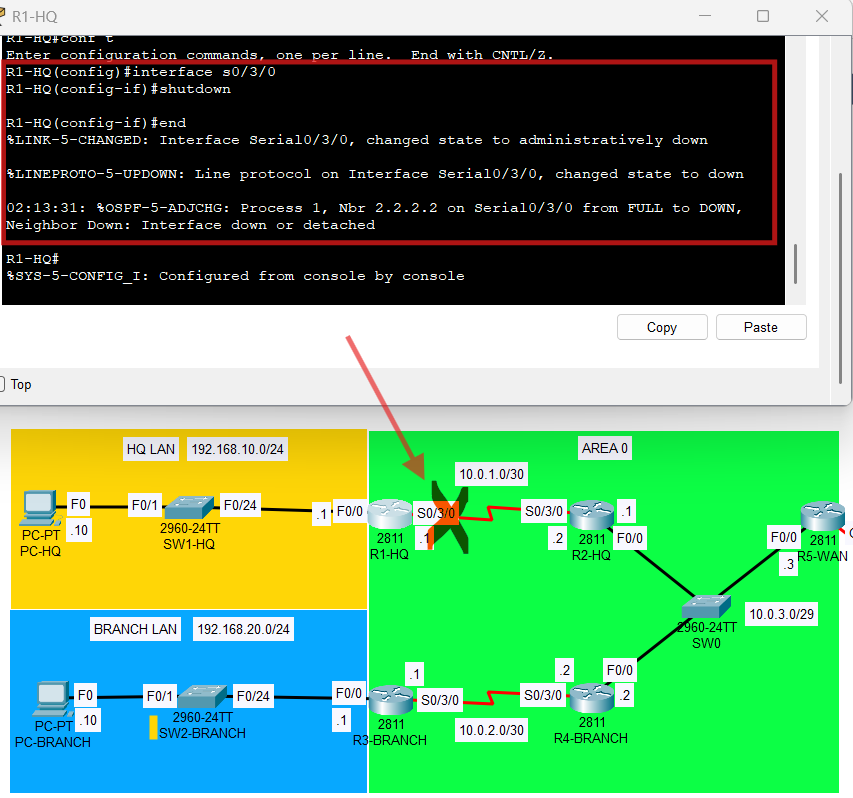
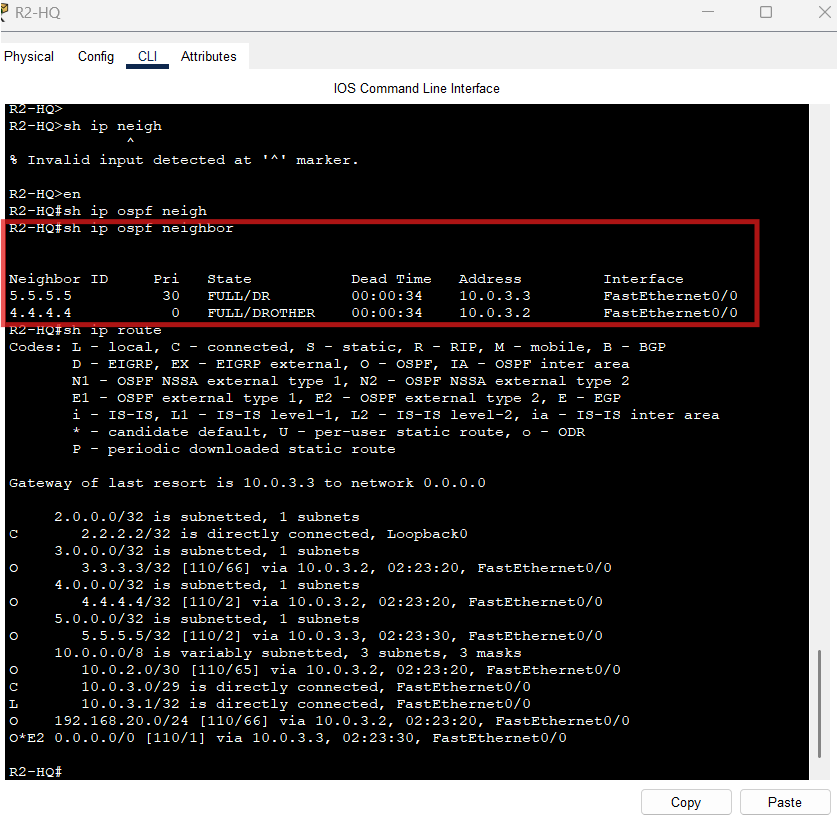
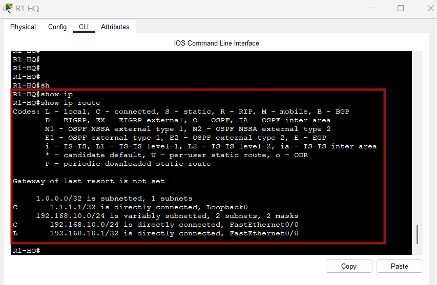
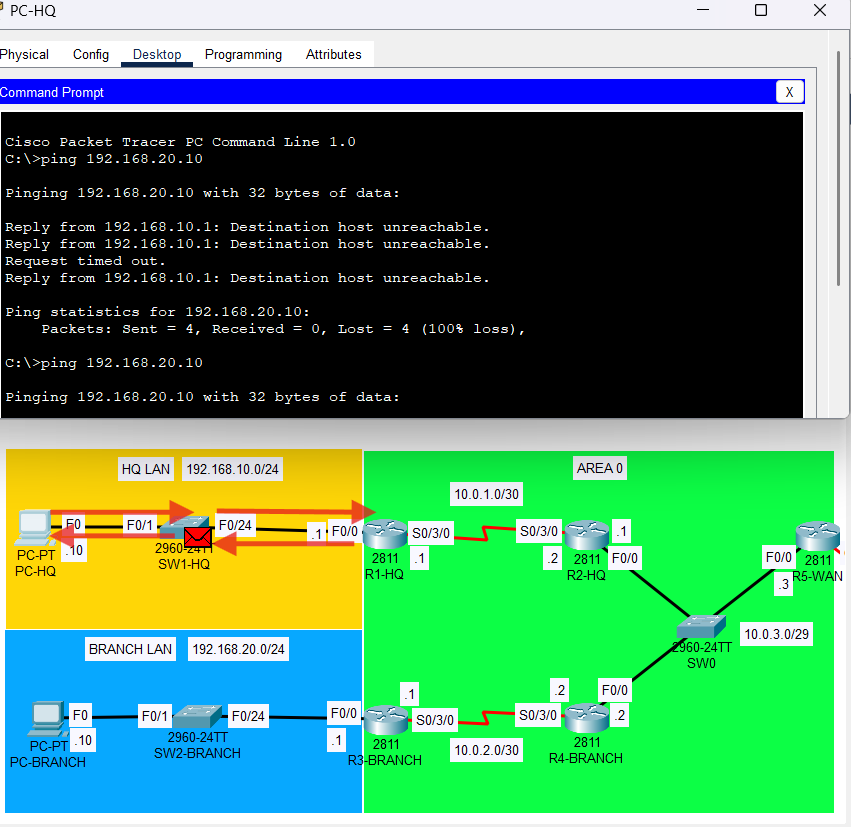
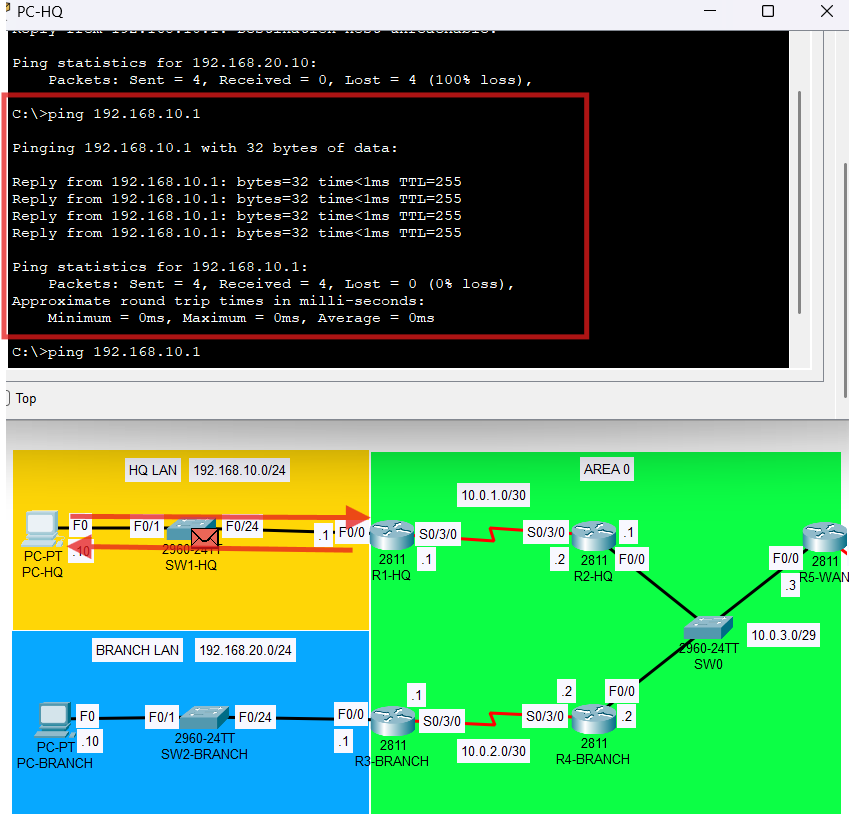

# Failure Test 1 – R1-HQ to R2-HQ Serial Link Down

## Objective
Simulate failure of the HQ-side point-to-point serial OSPF link and observe neighbor loss, route withdrawal, and site impact.

---

## Failure Action
Shutdown performed on:
- **R1-HQ Serial0/3/0**

### Command Used
- `interface s0/3/0`
- `shutdown`

---

## Expected Outcome
- OSPF adjacency between R1-HQ and R2-HQ drops
- R1-HQ loses learned routes from the rest of the OSPF domain
- HQ LAN becomes isolated from Branch and WAN-edge routes
- default route on R1-HQ disappears
- Branch side should remain internally connected to the rest of the non-HQ topology

---

## Verification Commands
- `show ip ospf neighbor`
- `show ip route`
- ping from PC-HQ to PC-BRANCH
- ping from PC-HQ to remote networks

---

## Expected Observations
- R1-HQ has no OSPF neighbor on Serial0/3/0
- R2-HQ no longer shows R1-HQ as a neighbor
- R1-HQ routing table contains only connected/local routes
- PC-HQ loses reachability to Branch and default-routed destinations

---

## Actual Result
The failure was successfully reproduced by shutting down `Serial0/3/0` on R1-HQ.

Observed results:
- R1-HQ no longer displayed any OSPF neighbor entries
- R2-HQ no longer displayed R1-HQ as an OSPF neighbor
- R2-HQ still maintained OSPF adjacencies with R4-BRANCH and R5-WAN on the Ethernet broadcast segment
- R1-HQ lost all remote OSPF-learned routes, including:
  - Branch LAN reachability
  - transit network reachability
  - remote loopback routes
  - external default route
- R2-HQ lost the HQ LAN route and R1-HQ loopback route
- PC-HQ could still reach its local default gateway `192.168.10.1`
- PC-HQ could no longer reach PC-BRANCH `192.168.20.10`
- ping failure returned `Destination host unreachable` from `192.168.10.1`, confirming the local gateway no longer had a route to the remote network

---

## Conclusion
Failure Test 1 behaved as expected.

Shutting down the point-to-point serial link between R1-HQ and R2-HQ caused the OSPF adjacency on that link to fail, which removed HQ connectivity from the rest of the OSPF domain. R1-HQ lost all remotely learned routes, including the external default route, while the Ethernet OSPF segment between R2-HQ, R4-BRANCH, and R5-WAN remained stable. This confirmed that the HQ site depends entirely on the R1-HQ to R2-HQ serial link for reachability beyond the local LAN.

---

## Evidence (Screenshots)
- 
- 
- 
- 
- 
- 
